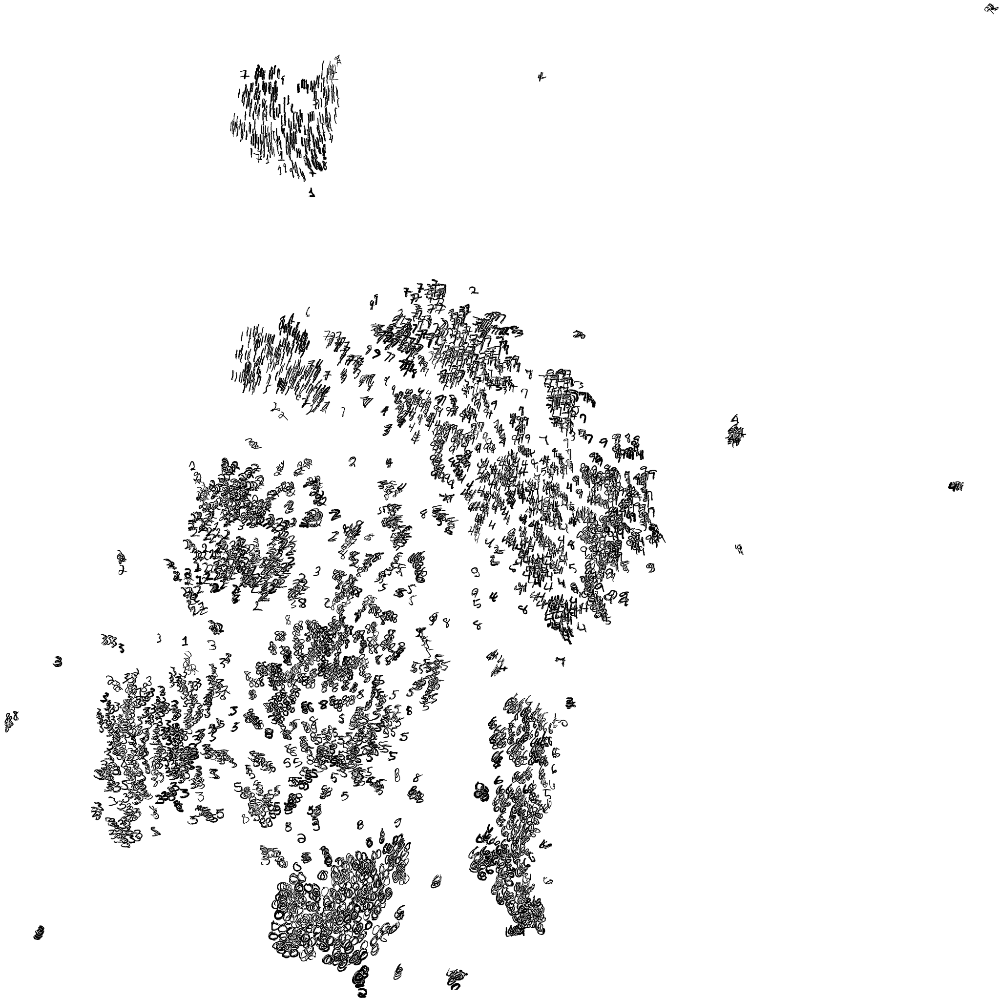

Manifold
========

A package to manipulate manifolds, for Torch7.

Install
-------

```sh
luarocks install manifold
```

Dependencies
------------

In order to be able to run the binaries, you need to install the package `libatlas3-base`.
On a Ubuntu machine you can execute the following commands.

```
sudo apt-get update
sudo apt-get install libatlas3-base
```

Use
---

```lua
-- package:
m = require 'manifold'

-- a dataset:
t = torch.randn(100,10) -- 100 samples, 10-dim each

-- basic functions:
ns = m.neighbors(t) -- return the matrix of neighbors for all samples (sorted)
ds = m.distances(t) -- return the matrix of distances (L2)
ts = m.removeDuplicates(t) -- remove duplicates from dataset

-- embeddings:
p = m.embedding.random(t, {dim=2})  -- embed samples into a 2D plane, using random projections
p = m.embedding.lle(t, {dim=2, neighbors=3})  -- embed samples into a 2D plane, using 3 neighbor (LLE)
p = m.embedding.tsne(t, {dim=2, perplexity=30})  -- embed samples into a 2D plane, using tSNE
```

Demos
-----

To run the demos, simply type the following commands.

```sh
cd demos
qlua demo_swissroll.lua
qlua demo_tsne.lua
```

Below is an example of a t-SNE map produced on 5,000 MNIST digits by the <code>demos/demo_tsne.lua</code> demo.


